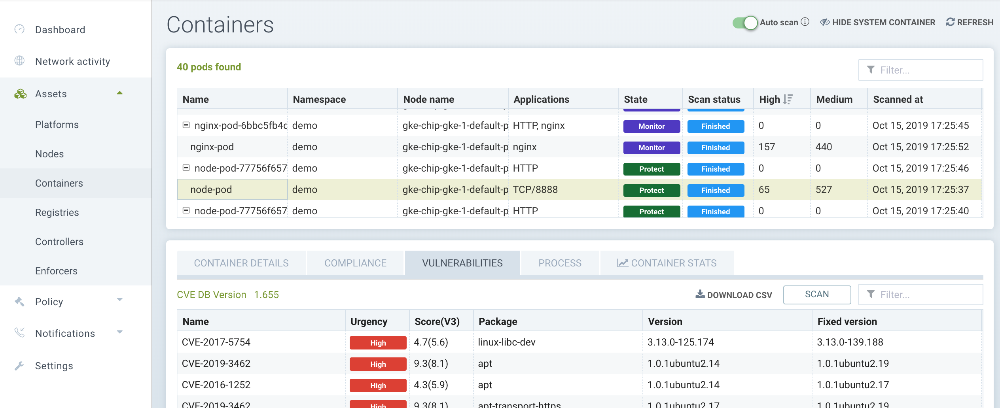

NeuVector enables full lifecycle scanning & compliance through vulnerability scanning and running of the CIS benchmarks for security, as well as custom compliance checks. The Security Risks menu enables customizable Vulnerability and Compliance management investigation, triage, and reporting. Easily research image vulnerabilities and find out which nodes or containers contain those vulnerabilities. Advanced filtering makes reviewing scan and compliance check results easy and provides customized reporting. It also provides standard and customizable compliance reports and templates for PCI, GDPR, and other regulations.

###Overview of NeuVector Scanning
Scanning is performed at all phases of the pipeline from Build to Registry to Run-Time, on various assets, as shown below.

| **Scan Type**        | Image   | Node  | Container | Orchestrator | Function |
| -------------------- | ------  | ----- | --------- | ------------ | -------- |
| **Vulnerabilities**  |   Yes   |  Yes  |    Yes    |     Yes      |   Yes    |
| **CIS Benchmarks**   |   Yes   |  Yes  |    Yes    |     Yes      |   N/A    |
| **Custom Compliance**|   No    |  Yes  |    Yes    |     No       |   No     |
| **Secrets**          |   Yes   |  Yes  |    Yes    |     No       |   Yes    |
| **Modules**          |   Yes   |  N/A  |    N/A    |     N/A      |   N/A    |

Images are scanned either in Registry scanning or through Build-phase plug-ins such as Jenkins, CircleCI, Gitlab etc.

The CIS Benchmarks support by NeuVector include:
+ Kubernetes
+ Docker
+ Red Hat OpenShift draft 'Inspired by CIS' benchmarks
+ Google GKE

The open source implementation of these benchmarks can be found on the [NeuVector Github page](https://github.com/neuvector).

Note 1: Secrets can also be detected on Nodes and in Containers with [Custom Scripts](/policy/customcompliance).

Note 2: Function scanning is provided in [Serverless Security](/serverless).

#### Kubernetes Resource Deployment File Scanning
NeuVector is able to scan deployment yaml files for configuration assessments against Admission Control rules. This is useful to scan deployment yaml files early in the pipeline to determine if the deployment would violate any rules before attempting the deployment. Please see [Configuration Assessment](/policy/admission/assessment) under Admission Controls for more details.

### Managing Vulnerabilities and Compliance

NeuVector provides several ways to review vulnerability and compliance scan results and generate reports. These include:

+ **Dashboard.** Review summary vulnerabilities and see how they impact the overall [Security Risk Score](/navigation/improve_score).
+ **Security Risks Menu.** View the impact of vulnerabilities and compliance issues and generate reports with advanced filtering.
+ **Assets Menu.** See vulnerability and compliance results for each asset such as registries, nodes, and containers.
+ **Notifications -> Risk Reports.** View scan events for each asset. 
+ **Response Rules.** Create responses such as web hook notifications or quarantines based on scan results.
+ **REST API.** Trigger scans and pull scan results programmatically to automate the process.
+ **SYSLOG/Webhook Alerts.** Send scan results to a SIEM or other enterprise platforms.

####Security Risks Menu

These menu's combine the results from registry (image), node, and container vulnerability scans and compliance checks found in the Assets menu to enable end-to-end vulnerability management and reporting. The Compliance profile menu enables customization of the PCI, GDPR and other compliance checks for generating compliance reports.

See the next section on [Vulnerability Management](/scanning/scanning/vulnerabilities) for how to manage vulnerabilities in this menu, and the [Compliance & CIS Benchmarks](/scanning/scanning/compliance) section for reporting on CIS Benchmarks and industry compliance such as PCI, GDPR, HIPAA, and NIST.

####Assets Menu
The Assets menu reports vulnerabilities and compliance checks results organized by the asset.
+ Platforms. The orchestration platform such as Kubernetes, and vulnerability scans of the platform.
+ Nodes. Nodes/hosts protected by NeuVector Enforcers, and results of Compliance checks such as CIS benchmarks and custom checks, as well as host vulnerability scans.
+ Containers. All containers in the cluster including system containers, and the results of Compliance checks such as CIS benchmarks and custom checks, as well as container run-time Vulnerability scans. Process activity and performance statistics can also be found here.
+ Registries. Registries/repositories scanned by NeuVector. Layered image scanning results are found here, and scan results can be used in Admission control rules (found in Policy -> Admission Controls).

Note: [Custom compliance checks](/policy/customcompliance) as mentioned above are defined in the [Policy -> Groups](/policy/groups) menu.

#### Automated Run-Time Scanning
NeuVector can scan running containers, host nodes, and the orchestration platform for vulnerabilities. In the Assets menu for Nodes or Containers, enable Auto-Scan by clicking on the Vulnerabilities tab for a node or container, then Auto-Scan (appears in upper right) to scan all running containers, nodes, and platform including newly started ones once they start running. You can also select a container or node and scan it manually.

You can click on each vulnerability name/CVE that is discovered to retrieve a description of it, and click on the inspect arrow in the popup to see the detailed description of the vulnerability.

The auto-scan will also be triggered when ever there is an update to the NeuVector CVE database. Please see the section [Updating the CVE Database](/scanning/updating) for details.

### Automated Actions, Mitigations, and Responses Based on Vulnerabilities
Admission control rules can be created to prevent deployment of vulnerable images based on Registry scanning results. See the Security Policy -> [Admission Control](/policy/admission) section for details.

Please see the section Security Policy -> [Response Rules](/policy/responserules) for instructions for creating automated responses to vulnerabilities detected either during registry scanning, run-time scanning, or CIS benchmarks. Responses can include quarantine, webhook notification, and suppression.
