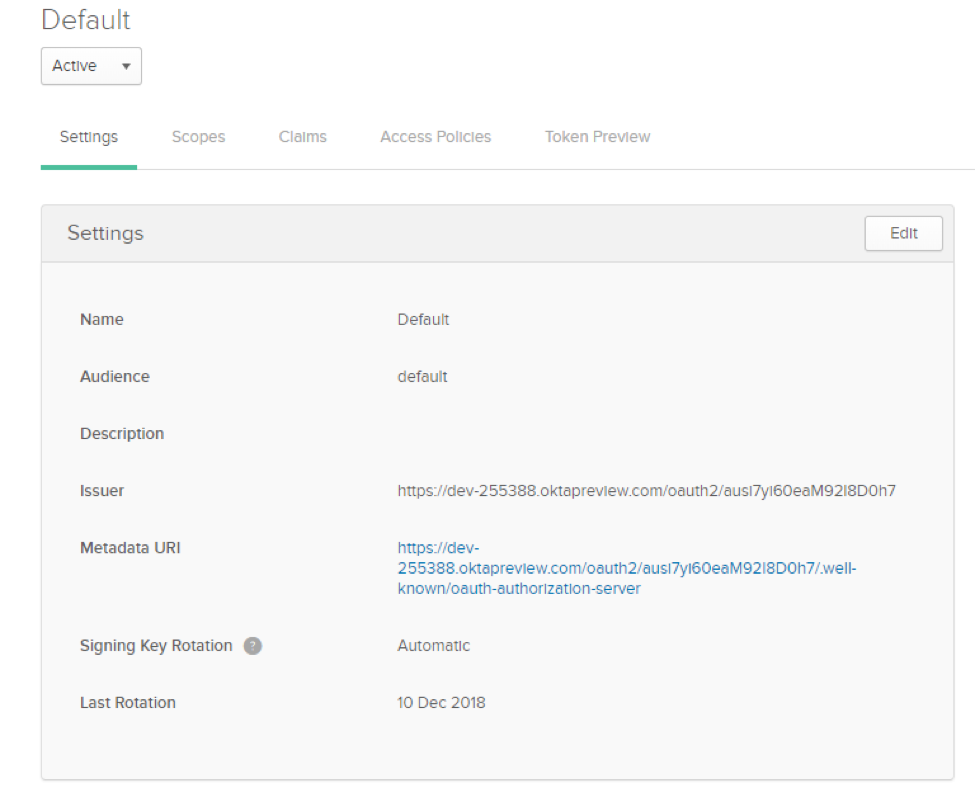
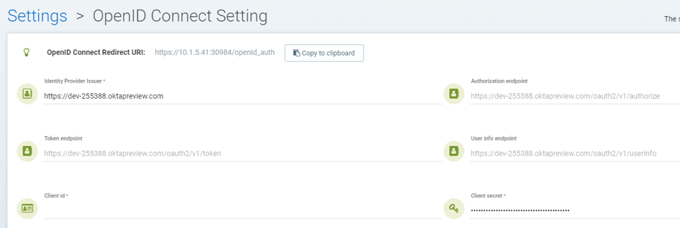

### Integrating with OpenID Connect (OIDC) for Azure and Okta

To enable OpenID Connect authentication, the **Issuer**, **Client ID** and **Client secret** settings are required. With the issuer URL, NeuVector will call the discovery API to retrieve the Authenorization, Token and User info endpoints.

Locate the OpenID Connect Redirect URI on the top of the NeuVector OpenID Connect Setting page. You will need copy this URI to the **Login redirect URIs** for Okta and **Reply URLs** for Microsoft Azure.

#### Microsoft Azure Configuration
In Azure Active Directory > App registrations > Application name > Settings Page, locate Application ID string. This is used to set the Client ID in NeuVector. The Client secret can be located in Azure's Keys setting.

The Issuer URL takes https://login.microsoftonline.com/{tenantID}/v2.0 format. To locate the tenantID, go to **Azure Active Directory > Properties Page** and found the Directory ID, replace it with the tenantID in the URL

If the users are assigned to the groups in the active directory, their group membership can be added to the claim. Find the application in **Azure Active Directory -> App registrations** and edit the manifest. Modify value of "groupMembershipClaims" to "All".

By default, NeuVector looks for "groups" in the claim to identify the user's group membership. If other claim name is used, you can customize the claim name in NeuVector's OpenID Connect Setting page.

The group claim returned by Azure are identified by the "Object ID" instead of the name. The group's object ID can be located in **Azure Active Directory > Groups > Group name Page**. You should use this value to configure group-based role mapping in NeuVector -> Settings.

<strong>Verify Permissions</strong>

Make sure the following permissions have been set from Microsoft Graph
1. email - View users' email address
2. openid - Sign users in
3. profile - View users' basic profile

#### Okta Configuration

Configure the **Login redirect URIs** in Okta Application's General tab with NeuVector's OpenID Connect Redirect URI, and Retrieve Client ID and secret on Okta Application's Sign On Tab.

Okta console can operate in two modes, Classic Mode and Developer Mode.

In the **Classic Mode**, issuer URL is located at Okta Application page's Sign On Tab. In order to have the user's group membership returned in the claim, you need to add "groups" scope in NeuVector OpenID Connect configuration page.

In the **Developer Mode**, Okta allows you to customize the claims. This is done in the API page by managing Authorization Servers. The issuer URL is located in each authorization server's Settings tab.

In the Claims page, you can create new claims with for user's Groups and carry the claim in ID Token. You can choose to include the claim in the 'Any' Scope. If a specific scope is configured, make sure to add the scope to NeuVector OpenID Connect setting page, so that the claim can be included after the user is authenticated.

By default, NeuVector looks for "groups" in the claim to identify the user's group membership. If other claim name is used, you can customize the claim name in NeuVector's OpenID Connect Setting page.

#### NeuVector OpenID Connect Configuration

Configure the proper Issuer URL, Client ID and Client secret in the page.

After the user is authenticated, the proper role can be derived with group-based role mapping configuration. To setup group-based role mapping,

1. If group-based role mapping is not configured or the matched groups cannot be located, the authenticated user will be assigned with the Default role. If the Default role is set to None, when group-based role mapping fails, the user is not able to login.
2. Specify a list of groups respectively in Admin and Reader role map. The user's group membership is returned by the claims in the ID Token after the user is authenticated. If the matched group is located, the corresponding role will be assigned to the user.

The group can be mapped to the Admin role in NeuVector. Individual users can be 'promoted' to a Federated Admin role by logging in as a local cluster admin, selecting the user with Identify Provider 'OpenID', and editing their role in Settings -> Users/Roles.

#### Mapping Groups to Roles and Namespaces
Please see the [Users and Roles](/configuration/users#mapping-groups-to-roles-and-namespaces) section for how to map groups to preset and custom roles as well as namespaces in NeuVector.
